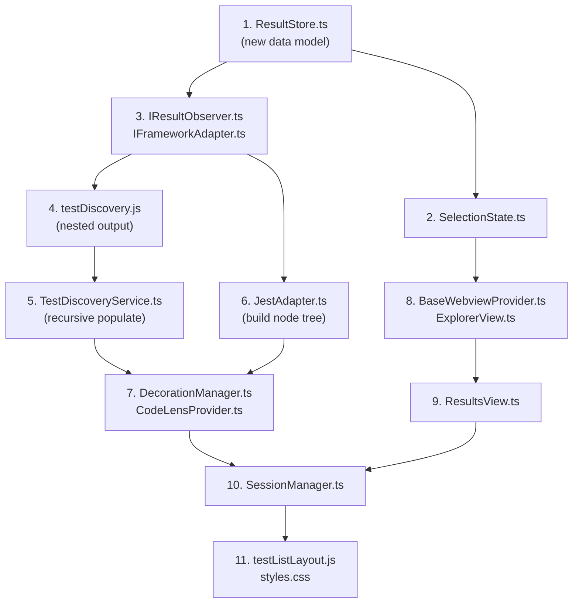

# Nested Node Tree Migration — Implementation Plan

Replace the fixed 3-layer `File → Suite → Test` hierarchy with a recursive `File → Node[]` tree that supports unlimited `describe` nesting. Currently nested describes like `describe('A', () => describe('B', () => ...))` are flattened into a single suite key `"A > B"`. This migration makes the tree model match the source code structure.

---

## Current State (Problem)

The `ResultStore` stores results as:

```
Map<filePath, FileResult>
  FileResult.suites: Map<suiteId, SuiteResult>
    SuiteResult.tests: Map<testId, TestCaseResult>
```

Nested `describe` blocks are collapsed into a single `SuiteResult` with a joined key — `describe('A', () => describe('B', ...))` becomes one suite `"A > B"`. This means:
- The UI tree shows suites flat under each file — no visual nesting
- `testDiscovery.js` already detects nesting (via a stack) but joins names before returning
- `JestAdapter._applyFileResult` uses `ancestorTitles.join(' > ')` — loses hierarchy
- Suite-level rerun, selection, and scoped output cannot target individual nesting levels

> [!IMPORTANT]
> **Migration approach:** Replace in-place (not dual-write). The old `SuiteResult`/`TestCaseResult` types are deleted. Every consumer is updated in a single coordinated change. There are no external consumers of these types, no tests to break, and no API contract to preserve — a clean swap is simpler and safer than maintaining two models in parallel.

---

## Target Data Model

### New types in `ResultStore.ts`

```typescript
export type NodeType = 'suite' | 'test';

export interface TestNode {
  id: string;              // stable composite key
  type: NodeType;
  name: string;
  fullName: string;        // ancestor chain for --testNamePattern

  fileId: string;          // back-reference to owning file
  parentId: string | null; // null = direct child of file
  children: string[];      // child node IDs (suites have children, tests don't)

  status: TestStatus;
  duration?: number;
  line?: number;

  output: ScopedOutput;
  failureMessages: string[];  // empty for suites
}

export interface FileResult {
  fileId: string;
  filePath: string;
  name: string;
  status: TestStatus;
  duration?: number;
  output: ScopedOutput;
  rootNodeIds: string[];     // replaces suites: Map<>
}
```

### Store internals

```typescript
export class ResultStore {
  private files = new Map<string, FileResult>();
  private nodes = new Map<string, TestNode>();   // flat node pool
  private _lineMap = new Map<string, Map<number, LineEntry>>();
}
```

### Updated `LineEntry`

```typescript
export type LineEntry = {
  nodeId: string;    // replaces testId + suiteId
  fileId: string;
};
```

### Updated `SelectionState`

```typescript
export type SelectionScope = 'file' | 'suite' | 'test';

export interface Selection {
  scope: SelectionScope;
  fileId: string;
  nodeId?: string;     // replaces suiteId + testId
}
```

---

## Performance at Scale (10,000+ Tests)

The current system already has targeted optimisations (`updateFile` only re-renders one file's DOM subtree, `_refreshFile` only touches editors showing that file). The new model must preserve and extend these.

### Status Rollup — Bubble-Up, Not Full Scan

The current `_applyFileResult` does a full walk of all suites/tests to roll up file status. With 10K+ tests this is fine (Maps are O(1) per lookup), but the new recursive tree must not walk the _entire_ tree on every single test result.

**Design:** Each `TestNode` has a `parentId`. When a test's status changes, `ResultStore` exposes a `bubbleUpStatus(nodeId)` helper:

```typescript
bubbleUpStatus(nodeId: string): void {
  let current = this.nodes.get(nodeId);
  while (current?.parentId) {
    const parent = this.nodes.get(current.parentId);
    if (!parent) break;
    // Derive parent status from its direct children only (not all descendants)
    const childStatuses = parent.children.map(id => this.nodes.get(id)?.status ?? 'pending');
    parent.status = childStatuses.includes('failed') ? 'failed'
                  : childStatuses.includes('running') ? 'running'
                  : childStatuses.every(s => s === 'passed') ? 'passed'
                  : childStatuses.every(s => s === 'skipped') ? 'skipped'
                  : 'pending';
    // Also accumulate duration from direct children
    parent.duration = parent.children.reduce(
      (sum, id) => sum + (this.nodes.get(id)?.duration ?? 0), 0
    );
    current = parent;
  }
  // Finally update the file's status from its rootNodeIds
  if (current) {
    const file = this.files.get(current.fileId);
    if (file) {
      const rootStatuses = file.rootNodeIds.map(id => this.nodes.get(id)?.status ?? 'pending');
      file.status = rootStatuses.includes('failed') ? 'failed'
                  : rootStatuses.includes('running') ? 'running'
                  : rootStatuses.every(s => s === 'passed') ? 'passed'
                  : 'pending';
    }
  }
}
```

This walks _up_ from the changed node — O(depth) not O(n). A 10-level deep tree touches at most 10 nodes. `JestAdapter._applyFileResult` calls this once per test case after setting its status, and the parent chain is immediately correct for the webview message that follows.

### markTestsRunning — Walk Down, Not Full Scan

The current `markTestsRunning` iterates all suites × tests. The new version:

```typescript
markNodeRunning(nodeId: string): void {
  const node = this.nodes.get(nodeId);
  if (!node) return;
  node.status = 'running';
  // Recursively mark all descendants
  for (const childId of node.children) {
    this.markNodeRunning(childId);
  }
}

markFileRunning(filePath: string): void {
  const file = this.files.get(filePath);
  if (!file) return;
  file.status = 'running';
  for (const rootId of file.rootNodeIds) {
    this.markNodeRunning(rootId);
  }
}
```

Targeted: `markNodeRunning('suiteId')` only touches that subtree, not the whole file.

### Decoration Updates — Per-File, Already Optimised

The existing `DecorationManager._refreshFile(filePath)` only processes editors showing that specific file. Each file has at most ~100-200 test lines. No change needed here — the `LineMap` lookup and node query are both O(1).

### Webview Updates — Targeted DOM Patching

The current `updateFile(fileData)` already does targeted DOM updates (replaces only the `[data-file-wrapper]` element for the affected file). This is critical at scale. The new model preserves this:
- `full-file-result` messages still carry one file's complete subtree
- `testListLayout.updateFile()` still patches only that file's DOM wrapper
- Full `_render()` only fires for search/filter operations (same as today)

For files with 500+ tests in a single file (rare but possible), we should add **lazy child rendering**: collapsed nodes don't render their children into the DOM. Children are rendered on expand. This prevents a single file result from creating 500+ DOM nodes when the user never expands it.

```javascript
// testListLayout.js — _renderNode only renders children if expanded
_renderNode(file, node, depth) {
  const isExpanded = this.expanded.has(node.id);
  // ...
  const children = isExpanded
    ? node.children.map(id => this._renderNode(file, file._nodeMap[id], depth + 1)).join('')
    : '';  // ← Don't create children DOM until expanded
  // ...
}
```

### getSummary — Maintain Running Counter

The current `getSummary()` walks every suite/test in the store on every call. With 10K+ tests, this is called on every file result (for the status bar and webview messages). 

**Optimisation:** Maintain a running counter `{ total, passed, failed, running }` updated incrementally inside `nodeResult()` and `nodeStarted()`. `getSummary()` returns the cached object in O(1).

```typescript
private _summary = { total: 0, passed: 0, failed: 0, running: 0, totalDuration: 0 };

nodeResult(nodeId: string, status: TestStatus, duration?: number, failureMessages?: string[]): void {
  const node = this.nodes.get(nodeId);
  if (!node || node.type !== 'test') return;
  // Decrement old status, increment new
  this._adjustSummary(node.status, -1);
  node.status = status;
  node.duration = duration;
  node.failureMessages = failureMessages ?? [];
  this._adjustSummary(status, +1);
}
```

---

## Node ID Strategy

### Why not UUIDs?

Node IDs must be **stable** across discovery and runs. Discovery creates nodes from AST analysis (before any test runs). When Jest produces results, `JestAdapter._applyFileResult` must match each result to the correct node. With UUIDs, you'd need a separate name→UUID lookup, which doubles the complexity and creates fragile cross-reference problems.

### Hierarchical path-based IDs (chosen approach)

```
{filePath}::{ancestorTitle1}::{ancestorTitle2}::...{name}
```

Both discovery and `JestAdapter` build the same ID from the same inputs:
- Discovery: suite stack names from the AST
- JestAdapter: `tc.ancestorTitles[]` + `tc.title`

**Same inputs → same ID → automatic match. No lookup needed.**

### Long ID concern

A worst case: `/Users/foo/projects/my-app/src/__tests__/components/auth/LoginForm.test.tsx::Authentication Flow::Login with Google OAuth::handles redirect callback::processes token exchange` — ~180 characters.

**This is not a problem because:**
- JavaScript engines intern short repeated strings and use hash-based `Map` keys — 200-char keys are fine for 10K entries
- The IDs are used as `Map` keys (hashed), `data-` attributes (no rendering cost), and `postMessage` payloads (serialised once)
- The _current_ system already has IDs this long: `${filePath}::${suiteKey}::${tc.fullName}` where `suiteKey` is `"A > B > C"` — same length
- We already have a 200-char cap on trace file names (`_safeFileName`) — IDs in memory don't need this

### Edge case: truly absurd names

If a test name exceeds 500 characters (unlikely but possible with deeply nested `.each` expansions), we **truncate** the ID at 500 chars with a hash suffix to keep uniqueness:

```typescript
function makeNodeId(filePath: string, ancestorNames: string[], name: string): string {
  const raw = [filePath, ...ancestorNames, name].join('::');
  if (raw.length <= 500) return raw;
  // Truncate and append a short hash for uniqueness
  const hash = simpleHash(raw).toString(36);
  return raw.slice(0, 480) + '::' + hash;
}
```

This preserves debuggability (the ID is still human-readable) while preventing pathological cases.

---

## Dynamic Test Names (Template Literals, `.each`, Loops)

This is the trickiest part. There are three categories:

### 1. `test.each` / `describe.each` (handled by discovery)

The current `testDiscovery.js` already detects the curried `.each` pattern and extracts the template name — e.g. `test.each([...])('accepts %s', fn)` yields name `"accepts %s"`. At discovery time, only **one** placeholder node is created.

At run time, Jest expands this into multiple results: `"accepts low"`, `"accepts high"`, etc. Each gets its own `ancestorTitles` + `title`.

**Strategy:** The placeholder node from discovery is a single node with name `"accepts %s"`. When Jest results arrive in `_applyFileResult`, the adapter:
1. Finds no existing node matching `"accepts low"` → creates a new node via `nodeStarted()`
2. Deletes the `"accepts %s"` placeholder via `removePendingPlaceholders()` (already exists)

The expanded nodes have correct IDs: `filePath::suite::accepts low`, `filePath::suite::accepts high`.

### 2. Template literals with dynamic interpolation

Current discovery produces: `"accepts valid severity …"`. This stays as a placeholder.

Jest results arrive as: `"accepts valid severity low"`, `"accepts valid severity high"`.

**Same strategy as `.each`:** placeholder is cleaned up, real nodes are created from Jest output. The `removePendingPlaceholders` method already handles this — it deletes nodes where `name.includes('…')`.

### 3. Tests inside `for` loops or dynamic generation

```js
for (const severity of ['low', 'medium', 'high']) {
  test(`severity ${severity}`, () => { ... });
}
```

Discovery cannot see inside the loop body (it's not a `test.each` pattern). Two sub-cases:

**a) Discovery catches the `test()` call inside the loop:**
The AST walker _will_ find the `test()` call with name `"severity …"`. One placeholder node is created. At run time, Jest produces three tests, the placeholder is cleaned up, and three real nodes replace it. Works correctly.

**b) Discovery misses it entirely (e.g. `test` called via a variable alias):**
No discovery node exists. When Jest results arrive, `_applyFileResult` creates nodes on the fly via `nodeStarted()`. The tree appears after the first run. This is the current behaviour and is acceptable — tests that can't be statically discovered simply appear after they run.

### Summary: Dynamic Name Handling Rules

| Source | Discovery | After Run | Cleanup |
|---|---|---|---|
| `test.each([...])('name %s')` | 1 node: `"name %s"` | N nodes: `"name a"`, `"name b"` | Placeholder removed |
| `` test(`name ${var}`) `` | 1 node: `"name …"` | N nodes: `"name x"`, `"name y"` | Placeholder removed |
| `for (...) { test(...) }` | 1 node: `"name …"` or 0 nodes | N nodes from Jest | Placeholder removed (if any) |
| Static `test('fixed')` | 1 node: `"fixed"` | Same node updated | No cleanup |

> [!IMPORTANT]
> `removePendingPlaceholders` must be updated to work on the flat `nodes` map: iterate all nodes for the given `fileId`, delete any test node (not suite) where `status` is `pending`/`running` and `name` contains `'…'` or `'%'` (for `.each` printf patterns). Also remove from parent's `children` array.

---

## Proposed Changes

### Node ID Convention

Node IDs are built hierarchically to stay stable across discovery and runs:

| Scope | Pattern | Example |
|-------|---------|---------|
| Root suite | `{filePath}::A` | `/path/file.test.ts::Auth` |
| Nested suite | `{filePath}::A::B` | `/path/file.test.ts::Auth::login` |
| Test in suite | `{filePath}::A::B::test-name` | `/path/file.test.ts::Auth::login::returns token` |
| Root test | `{filePath}::(root)::test-name` | `/path/file.test.ts::(root)::works` |

This matches the current `suiteId`/`testId` convention but extends naturally to deeper levels. The `fullName` field (used for `--testNamePattern`) stays the same: `"A B returns token"` (space-separated, not `>`-separated, to match Jest).

---

### Data Layer

#### [MODIFY] [ResultStore.ts](file:///Users/eshandias/Projects/Personal/live-test-runner/packages/vscode-extension/src/store/ResultStore.ts)

- Delete `SuiteResult`, `TestCaseResult` interfaces
- Add `TestNode`, `NodeType` types
- Replace `FileResult.suites: Map<>` with `rootNodeIds: string[]`
- Add `nodes: Map<string, TestNode>` private field
- Replace all mutation methods with node-based equivalents:
  - `suiteDiscovered / testDiscovered` → `nodeDiscovered(fileId, nodeId, parentId, type, name, fullName, line?)`
  - `suiteStarted / testStarted` → `nodeStarted(fileId, nodeId, parentId, type, name, fullName, line?)`
  - `suiteResult / testResult` → `nodeResult(nodeId, status, duration?, failureMessages?)`
  - `setSuiteOutput / setTestOutput` → `setNodeOutput(nodeId, output)`
  - `getSuiteOutput / getTestOutput` → `getNodeOutput(nodeId)`
  - `getSuite / getTest` → `getNode(nodeId)`
- Replace `markTestsRunning(filePath, suiteId?, testId?)` → `markTestsRunning(filePath, nodeId?)`
  - If `nodeId` given, mark that node and all descendants running
  - If no `nodeId`, mark all nodes in the file running
- Update `getSummary()` to iterate `nodes` where `type === 'test'`
- Update `toJSON()` to recursively serialize the node tree
- Update `resetToPending()` to iterate flat nodes map
- Update `removePendingPlaceholders()` to work on nodes
- Update `LineEntry` to use `nodeId` instead of `testId`/`suiteId`
- Add `getChildren(nodeId)`, `getDescendantTests(nodeId)` helpers

#### [MODIFY] [SelectionState.ts](file:///Users/eshandias/Projects/Personal/live-test-runner/packages/vscode-extension/src/store/SelectionState.ts)

- Replace `suiteId?: string; testId?: string` with `nodeId?: string`
- `scope` derived from the node's `type` (or `'file'` if no `nodeId`)

---

### Discovery Layer

#### [MODIFY] [testDiscovery.js](file:///Users/eshandias/Projects/Personal/live-test-runner/packages/vscode-extension/src/session/instrumentation/testDiscovery.js)

- Return nested suite structure instead of flat joined names
- New return shape:
  ```js
  {
    suites: [{
      name: "Auth",
      line: 5,
      isSharedVars: false,
      sharedVarNames: [],
      tests: [{ name: "works", line: 6, fullName: "Auth works" }],
      children: [{                              // NEW: nested suites
        name: "login",
        line: 8,
        isSharedVars: true,
        sharedVarNames: ["db"],
        tests: [{ name: "returns token", line: 9, fullName: "Auth login returns token" }],
        children: [],
      }],
    }],
    rootTests: [{ name: "top-level", line: 1, fullName: "top-level" }],
  }
  ```
- Modify the traversal to use the existing `describeStack` to build the tree recursively instead of joining names
- `fullName` for tests stays as a space-separated chain (matching Jest's convention)

#### [MODIFY] [TestDiscoveryService.ts](file:///Users/eshandias/Projects/Personal/live-test-runner/packages/vscode-extension/src/session/TestDiscoveryService.ts)

- Update `_populateFile` to walk the nested suite tree recursively
- Build hierarchical node IDs: `filePath::suite1::suite2::testName`
- Call `store.nodeDiscovered(...)` instead of `store.suiteDiscovered / testDiscovered`
- Build `LineEntry` with `{ nodeId, fileId }` instead of `{ testId, suiteId, fileId }`
- Update the serialization at the bottom to produce the recursive tree shape

---

### Write Path (Framework Adapter)

#### [MODIFY] [JestAdapter.ts](file:///Users/eshandias/Projects/Personal/live-test-runner/packages/vscode-extension/src/framework/JestAdapter.ts)

- Update `_applyFileResult` to build node IDs from `ancestorTitles` array:
  ```
  ancestorTitles = ['Auth', 'login']
  → suiteId chain: filePath::Auth, filePath::Auth::login
  → testId: filePath::Auth::login::test-title
  ```
- Create/update suite nodes for each level of `ancestorTitles` (not just the joined key)
- Each suite node's `parentId` points to the previous level or `null` for root
- Each suite gets added to its parent's `children` array (or `file.rootNodeIds`)
- `fullName` for tests: `ancestorTitles.join(' ') + ' ' + title` (same as Jest's `tc.fullName`)
- Update output attribution to use `store.setNodeOutput(nodeId, output)`
- Update `LineEntry` creation to use `{ nodeId, fileId }`
- Update status rollup logic to walk up from test nodes to parent suite nodes

---

### Read Paths (Views & Decorations)

#### [MODIFY] [DecorationManager.ts](file:///Users/eshandias/Projects/Personal/live-test-runner/packages/vscode-extension/src/editor/DecorationManager.ts)

- Update `applyToEditor` to use `entry.nodeId` and `store.getNode(entry.nodeId)`
- Determine `durationLevel` from `node.type` instead of checking `entry.testId`

#### [MODIFY] [CodeLensProvider.ts](file:///Users/eshandias/Projects/Personal/live-test-runner/packages/vscode-extension/src/editor/CodeLensProvider.ts)

- Update `◈ Results` lens arguments from `(fileId, suiteId, testId)` to `(fileId, nodeId)`
- `focusResult` command signature changes accordingly

#### [MODIFY] [BaseWebviewProvider.ts](file:///Users/eshandias/Projects/Personal/live-test-runner/packages/vscode-extension/src/views/BaseWebviewProvider.ts)

- Update `onFileResult` serialization to emit recursive node tree instead of `suites[]`
- Update `select` message handler: `suiteId/testId` → `nodeId`
- Update `rerun` message handler: `suiteId/testId` → `nodeId`
- Update `onFilesRerunning`: `suiteId/testId` → `nodeId`

#### [MODIFY] [ExplorerView.ts](file:///Users/eshandias/Projects/Personal/live-test-runner/packages/vscode-extension/src/views/ExplorerView.ts)

- Update `_sendInit` to pass the recursive tree shape

#### [MODIFY] [ResultsView.ts](file:///Users/eshandias/Projects/Personal/live-test-runner/packages/vscode-extension/src/views/ResultsView.ts)

- Replace `_buildSuitePayload / _buildTestPayload` with a single `_buildNodePayload(fileId, nodeId)`
- Walk from the selected node down to collect logs and errors from descendants
- `sendScopedData(fileId, nodeId?)` replaces `sendScopedData(fileId, suiteId?, testId?)`

---

### Session Layer

#### [MODIFY] [SessionManager.ts](file:///Users/eshandias/Projects/Personal/live-test-runner/packages/vscode-extension/src/session/SessionManager.ts)

- Update `rerunScope` to accept `nodeId` instead of `suiteId/testId`
- Determine run scope from `node.type`:
  - `type === 'test'` → rerun single test by `fullName`
  - `type === 'suite'` → rerun by suite `fullName`
- Update `_runTestCases` promotion logic to use node tree:
  - Check if all tests under a node are covered → promote to file run
  - Check if an entire suite subtree is covered → run suite by name
- Update `_applyTraceLogs` to iterate via `store.getFile(filePath).rootNodeIds` and walk the tree
- Update `_refreshScopedLogs` signature: `suiteId/testId` → `nodeId`
- Update `onFilesRerunning` notification: `suiteId/testId` → `nodeId`

#### [MODIFY] [SessionTraceRunner.ts](file:///Users/eshandias/Projects/Personal/live-test-runner/packages/vscode-extension/src/session/SessionTraceRunner.ts)

- No changes needed — it operates on `fullTestName` strings and `ExecutionTraceStore`, not on `ResultStore` types directly. The `_extractSuiteName` helper already works with `" > "` separators which remain the same (Jest's `ancestorTitles` format).

---

### Webview Layer

#### [MODIFY] [testListLayout.js](file:///Users/eshandias/Projects/Personal/live-test-runner/packages/vscode-extension/src/webview/testListLayout.js)

- Replace `_renderSuite(file, suite)` with `_renderNode(file, node, depth)`
- The `node` object now has `{ id, type, name, fullName, status, duration, line, children[], failureMessages }`
- Recursive rendering: for each child ID, look up the node in the file's flat node map and call `_renderNode` again
- The data payload from extension now contains: `file.nodes: Node[]` (flat pool) + `file.rootNodeIds: string[]`
- `_renderFile` iterates `rootNodeIds`, resolves each to a node, renders recursively
- Update `markFileRunning`, `_autoExpand`, `setSelected`, expand/collapse to use `node.id` instead of `suiteId`
- Increase CSS indent per depth level for visual nesting
- `data-suite`/`data-test` attributes → `data-node` attribute, `data-scope` stays as `'suite'`/`'test'` based on `node.type`
- `select` message: `nodeId` instead of separate `suiteId/testId`
- `rerun` message: `nodeId` + `fullName` instead of separate fields

#### [MODIFY] [styles.css](file:///Users/eshandias/Projects/Personal/live-test-runner/packages/vscode-extension/src/webview/styles.css)

- Add CSS for deeper nesting levels (dynamic `padding-left` based on depth)
- Existing `.level-suite` and `.level-test` classes stay, but indent is now depth-aware

---

### Messaging Protocol Changes

| Message field | Before | After |
|---|---|---|
| `select` | `{ fileId, suiteId?, testId? }` | `{ fileId, nodeId? }` |
| `rerun` | `{ fileId, suiteId?, testId?, fullName? }` | `{ fileId, nodeId?, fullName? }` |
| `scope-changed` | `{ fileId, suiteId?, testId? }` | `{ fileId, nodeId? }` |
| `files-rerunning` | `{ fileIds, suiteId?, testId? }` | `{ fileIds, nodeId? }` |
| `full-file-result.file` | `{ ...file, suites: [...] }` | `{ ...file, rootNodeIds: string[], nodes: TestNode[] }` |
| `scope-logs` | Built from `suiteId/testId` | Built from `nodeId` |
| `focusResult` args | `(fileId, suiteId, testId)` | `(fileId, nodeId)` |

---

### Files NOT Changed

| File | Why |
|---|---|
| `packages/runner/src/types.ts` | `TestCaseRunResult.ancestorTitles[]` already carries the full hierarchy — no change needed |
| `packages/runner/src/parsing/ResultParser.ts` | Produces `ancestorTitles` correctly — no change needed |
| `packages/core/*` | `CoverageMap`, `TestSession` operate on file paths only |
| `ExecutionTraceStore.ts` | Operates on `fullTestName` strings, not on `ResultStore` types |
| `SessionTraceRunner.ts` | Uses `fullTestName` strings, works without changes |
| `IFrameworkAdapter.ts` | `RerunOptions` keeps `suiteId/testId` for the adapter's internal use — **wait, this does need updating** |
| `timeline/*` | Timeline operates on `TimelineStore`, independent of result store hierarchy |

> [!WARNING]
> `IFrameworkAdapter.ts`: `RerunOptions` currently has `suiteId?` and `testId?` fields. These need to change to `nodeId?`. Both `JestAdapter.ts` and `SessionManager.ts` use these, so they must be updated together.

---

## File Change Summary

| # | File | Change type | Size estimate |
|---|---|---|---|
| 1 | `ResultStore.ts` | Heavy rewrite | Large |
| 2 | `SelectionState.ts` | Small update | Small |
| 3 | `testDiscovery.js` | Return nested tree | Medium |
| 4 | `TestDiscoveryService.ts` | Recursive population | Medium |
| 5 | `JestAdapter.ts` | Build node hierarchy from `ancestorTitles` | Medium |
| 6 | `IFrameworkAdapter.ts` | `RerunOptions` → `nodeId` | Small |
| 7 | `DecorationManager.ts` | Use `nodeId` lookup | Small |
| 8 | `CodeLensProvider.ts` | Use `nodeId` | Small |
| 9 | `BaseWebviewProvider.ts` | Recursive serialization, message updates | Medium |
| 10 | `ExplorerView.ts` | Pass node tree in init | Small |
| 11 | `ResultsView.ts` | Node-based scoped logs | Medium |
| 12 | `SessionManager.ts` | Node-based rerun logic | Medium |
| 13 | `testListLayout.js` | Recursive rendering | Medium |
| 14 | `styles.css` | Nesting indentation | Small |
| 15 | `IResultObserver.ts` | `suiteId/testId` → `nodeId` | Small |

**Total: 15 files changed, 0 new files, 0 deleted files**

---

## Implementation Order

The changes have strict dependencies. Implementation must follow this order:



**Suggested implementation phases:**

1. **Phase 1 — Data model** (files 1–3): `ResultStore`, `SelectionState`, `IResultObserver`, `IFrameworkAdapter`
2. **Phase 2 — Write paths** (files 4–6): `testDiscovery.js`, `TestDiscoveryService`, `JestAdapter`
3. **Phase 3 — Read paths** (files 7–10): `DecorationManager`, `CodeLensProvider`, `BaseWebviewProvider`, `ExplorerView`, `ResultsView`, `SessionManager`
4. **Phase 4 — Webview** (files 11): `testListLayout.js`, `styles.css`

---

## Verification Plan

There are no existing unit tests in the repository. Verification is manual.

### Manual Verification

After implementing all changes, open the Extension Development Host (`F5` in VS Code) and test against a real project that has nested describes:

**Test fixture** — create a file `nested.test.js` in the test project:
```js
describe('Auth', () => {
  describe('login', () => {
    describe('with valid credentials', () => {
      test('returns a token', () => { expect(true).toBe(true); });
      test('sets session', () => { expect(1).toBe(1); });
    });
    describe('with invalid credentials', () => {
      test('throws error', () => { expect(() => { throw new Error(); }).toThrow(); });
    });
  });
  test('root auth test', () => { expect(true).toBe(true); });
});

test('top-level test', () => { expect(true).toBe(true); });
```

**Checks:**

1. **Discovery** — On extension activate (before Start Testing):
   - Sidebar tree shows: `nested.test.js > Auth > login > with valid credentials > returns a token` (4 levels)
   - Gutter shows pending `○` icons at the correct lines
   - CodeLens `▶ Run` / `▷ Debug` buttons appear at every `describe`/`test` line

2. **Full run** — Click Start Testing:
   - All tests run and tree updates with `✓` icons at each level
   - Suite durations are rolled up correctly at every nesting level
   - Status bar shows correct counts

3. **Suite rerun** — Click `▶` on the `login` suite row:
   - Only tests inside `login` rerun (both `with valid credentials` and `with invalid credentials`)
   - Other tests stay unchanged

4. **Test rerun** — Click `▶` on an individual test:
   - Only that single test reruns

5. **Selection & scoped logs** — Click on each level in sidebar/results panel:
   - File level: shows all logs
   - `login` suite level: shows only logs from `login` and descendants
   - Individual test level: shows only that test's logs

6. **Editor decorations** — Verify gutter icons and inline duration text appear at correct lines for all nesting levels

7. **On-save rerun** — Edit a source file imported by the test:
   - Correct affected tests rerun (trace store still works)

8. **Stop session** — All decorations clear properly
