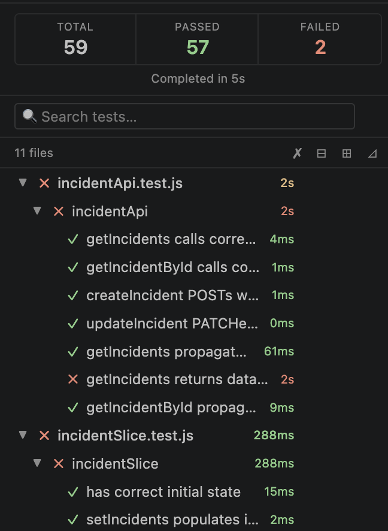
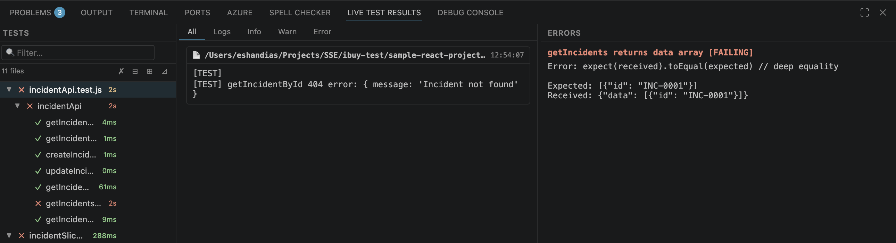
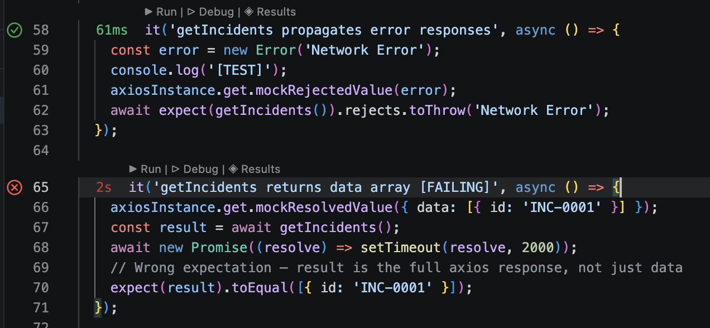

# Live Test Runner 

  

> **Only Supports `Jest` at the moment**

---

## Why Live Test Runner?

Most test runners make you switch context — open a terminal, run a command, scroll through output. Live Test Runner brings tests into the editor. Save a file and your results update instantly. Click a line and jump straight to the failure. Everything is one panel away.

No configuration required for standard Jest projects. No dependency on the VS Code Test Explorer API.

---

## Features

### Always-on test watching

Tests re-run automatically on every save. A status bar badge gives you a one-glance pass/fail count without opening the panel.

---

### Custom Test Explorer

A sidebar panel shows your full test suite as a **file → suite → test** tree. Every row has live status icons and color-coded duration badges.

---

### Live Results panel

A three-column split view for deep inspection:

| Column | What it shows |
|--------|--------------|
| **Tests** | The same file → suite → test tree, with search and filters |
| **Output** | Console logs for the selected test, tabbed by level (All / Logs / Info / Warn / Error) |
| **Errors** | Failure messages and stack traces for the selection |

---

### Editor decorations & CodeLens

Every `it()` and `test()` line gets:

- **Gutter icon** — ✓ pass (green) · ✗ fail (red) · ⟳ running (amber) · ○ pending (grey)
- **Inline duration** — muted label after the closing paren, color-coded by threshold
- **`▶ Run`** — rerun just this test (or suite, or file) without touching anything else
- **`▷ Debug`** — launch Jest under the debugger, scoped to this test via `--testNamePattern`
- **`◈ Results`** — jump straight to this test in the Results panel

---

### Smart Jest detection

Automatically detects:

- Standard `jest` in `node_modules/.bin`
- Create React App / `react-scripts test`
- Custom commands via the `liveTestRunner.jestCommand` setting

---

## Quick Start

1. Open a Jest project in VS Code
2. Click the **beaker icon** in the Activity Bar to open Live Test Runner
3. Click **▶ Start Testing** — the extension discovers test files, runs them all, and starts watching
4. Edit any source or test file, save, and watch results update in real time

> No `jest.config` changes needed. No extra dependencies to install.

---

## Commands

| Command | Description |
|---------|-------------|
| `Live Test Runner: Start Testing` | Discover and run all tests, then start watching for saves |
| `Live Test Runner: Stop Testing` | End the current session |
| `Live Test Runner: Select Project Root` | Pick a root in a multi-folder workspace |
| `Live Test Runner: Show Raw Output` | Open the raw Jest output channel for debugging |

---

## Configuration

All settings are under `liveTestRunner.*` in VS Code settings.

### General

| Setting | Default | Description |
|---------|---------|-------------|
| `liveTestRunner.projectRoot` | `""` | Project root (auto-detected for single-folder workspaces) |
| `liveTestRunner.runMode` | `"auto"` | `"auto"`: extension calls Jest directly for full structured output. `"npm"`: delegates to your `npm test` script — useful when Jest is wrapped or non-standard, but per-test durations and gutter icons may be limited. |
| `liveTestRunner.jestCommand` | `""` | Override the Jest command (e.g. `node_modules/.bin/jest`). Only used when `runMode` is `"auto"`. |
| `liveTestRunner.onSaveDebounceMs` | `300` | Milliseconds to wait after a save before triggering a run |

### Duration thresholds

Control when duration badges switch from green → amber → red. Separate thresholds per level so suite and file budgets aren't judged by the same bar as individual tests.

| Setting | Default | Level |
|---------|---------|-------|
| `liveTestRunner.durationThresholds.testAmberMs` | `100` | Test turns amber |
| `liveTestRunner.durationThresholds.testRedMs` | `500` | Test turns red |
| `liveTestRunner.durationThresholds.suiteAmberMs` | `500` | Suite turns amber |
| `liveTestRunner.durationThresholds.suiteRedMs` | `2000` | Suite turns red |
| `liveTestRunner.durationThresholds.fileAmberMs` | `1000` | File turns amber |
| `liveTestRunner.durationThresholds.fileRedMs` | `5000` | File turns red |

---

## Status Bar

| Badge | Meaning |
|-------|---------|
| `Live Tests: Off` | No session active |
| `Live Tests: Discovering…` | Finding test files |
| `Live Tests: Running… N/M` | Run in progress |
| `Live Tests: ✅ N passed` | All tests passed |
| `Live Tests: ❌ N failed, M passed` | Failures present |

---

## Supported Frameworks

| Framework | Status |
|-----------|--------|
| Jest | Fully supported |
| Create React App (react-scripts) | Fully supported |
| Vitest | Planned |

---

## Known Limitations

- Rerunning an individual test uses `--testNamePattern`, which may match multiple tests if names overlap
- Logs only get capured at file level.
- Live run only works on test file for the moment.

---
## About

  

This software is built by `EshLabs` (Eshan Dias). I’m a software engineer who was tired of paying for third-party tools, so I decided to create my own tools to help streamline development.  

I built this tool because during development, we often forget about test cases, and running them after completing a project to find errors can take a lot of time. With this tool, I can immediately see if any test cases fail as I code, making the debugging process faster and more efficient.  

If this tool helps you as much as it helps me, please give it a ⭐ on [GitHub](https://github.com/eshandias/live-test-runner)!

---

## Contributing

Bug reports, feature requests, and pull requests are welcome at [github.com/eshandias/live-test-runner](https://github.com/eshandias/live-test-runner).

---

## License

MIT
