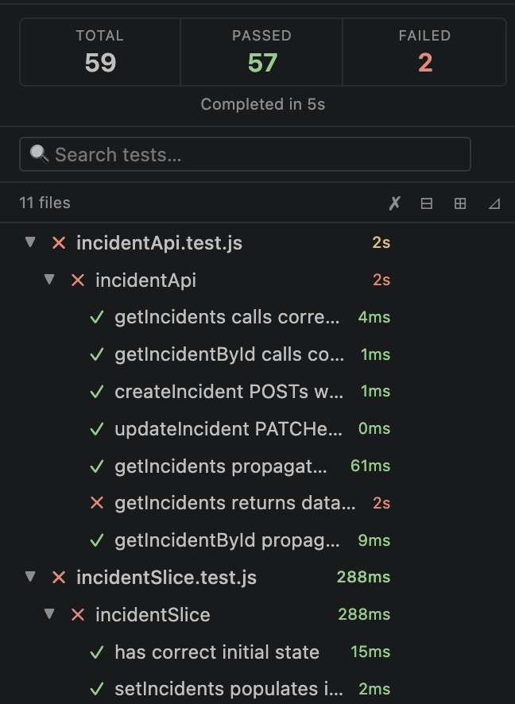
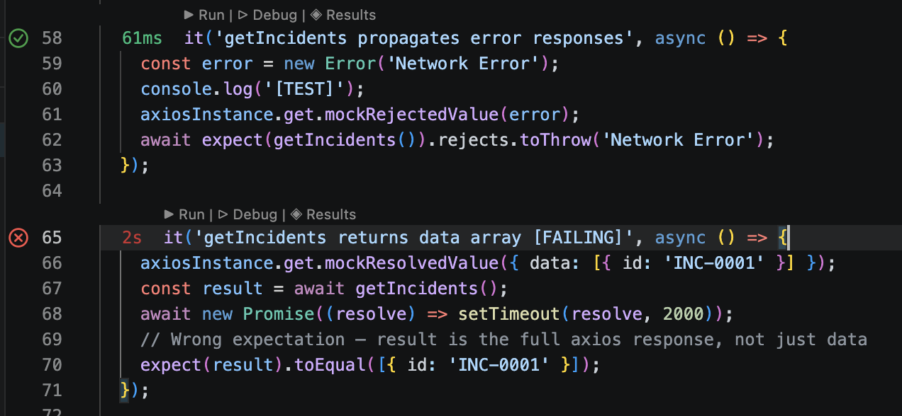
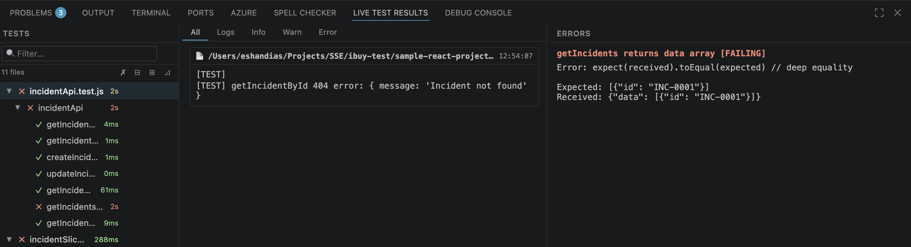

<!-- # Live Test Runner  -->

  <b>
    Live Test Runner
    
  </b>

> Save a file. Tests run. Results appear inline. No terminal. No config.

> **Only supports `Jest` at the moment**

<!-- [TODO: USER_INPUT_NEEDED] Replace with an updated hero gif showing the full experience (test run + coverage bars + hover) -->

---

## What you get

| | Feature | |
|---|---|---|
| ⚡ | **Live reruns on save** — targeted, file or test level | |
| 🌳 | **Test tree in the sidebar** — file → suite → test, instant on open | |
| 🎨 | **Editor decorations** — gutter icons, inline duration, CodeLens buttons | |
| 📊 | **Per-line code coverage** — coloured bars + hover shows which tests hit each line | |
| 🔍 | **Results panel** — 3-column view: test list · console output · errors | |
| ⏱ | **Timeline Debugger** *(coming soon)* — step through a test like a time-travel debugger | |

---

## Quick Start

1. Open a Jest project in VS Code
2. Click the **beaker icon** in the Activity Bar
3. Click **▶ Start Testing**
4. Save any file — results update instantly

> No `jest.config` changes. No extra installs.

---

## Features

### Test tree & always-on watching

Your full suite — every file, suite, and test — appears in the sidebar on project open before any run. Tests rerun on every save. The status bar shows a live pass/fail count.

<!-- [TODO: USER_INPUT_NEEDED] Short gif: sidebar tree populating on open, then a test going red/green on save -->

---

### Editor decorations & CodeLens

Every `it()` / `test()` line gets a gutter icon, inline duration, and action buttons:

- ✓ / ✗ / ⟳ / ○ gutter icons — live from project open
- `▶ Run` · `▷ Debug` · `◈ Results` CodeLens above each block
- Inline duration label, color-coded by threshold

<!-- [TODO: USER_INPUT_NEEDED] Screenshot or short gif of gutter icons + CodeLens in action -->

---

### Live code coverage

After the first run, every source file shows per-line coverage — no separate command needed.

| Bar | Meaning |
|-----|---------|
| Green `▌` | Covered by all tests |
| Amber `▌` | Covered by some tests |
| Red `▌` | Never executed |
| Grey `▌` | Not executable |

Hover any line to see which tests cover it. Coverage updates on every save.

<!-- [TODO: USER_INPUT_NEEDED] Screenshot or gif of coverage bars + hover tooltip in a source file -->

---

### Results panel

3-column view: test tree with search · console output tabbed by level · failure messages and stack traces.

<!-- [TODO: USER_INPUT_NEEDED] Screenshot of the 3-column results panel -->

---

### Timeline Debugger *(coming soon)*

Step through any test case line by line — variable values as inline ghost text, watch panel, call stack, no breakpoints needed.

<!-- [TODO: USER_INPUT_NEEDED] Preview gif or screenshot of timeline debugger once available -->

---

## Commands

| Command | What it does |
|---------|-------------|
| `Start Testing` | Run all tests and start watching |
| `Stop Testing` | End the session |
| `Stop Testing and Clear Cache` | Stop + wipe discovery cache |
| `Clear Cache and Restart Testing` | Fresh restart |
| `Select Project Root` | Pick root in multi-folder workspace |
| `Show Raw Output` | Open raw Jest output channel |

> **Tip:** Shift-click **⏹ Stop** to stop and clear cache in one click.

---

## Configuration

All settings under `liveTestRunner.*`.

| Setting | Default | Description |
|---------|---------|-------------|
| `projectRoot` | `""` | Auto-detected for single-folder workspaces |
| `runMode` | `"auto"` | `"auto"` calls Jest directly; `"npm"` delegates to `npm test` |
| `jestCommand` | `""` | Override Jest binary path |
| `onSaveDebounceMs` | `300` | Debounce delay after save (ms) |
| `durationThresholds.testAmberMs` | `100` | Test turns amber |
| `durationThresholds.testRedMs` | `500` | Test turns red |
| `durationThresholds.suiteAmberMs` | `500` | Suite turns amber |
| `durationThresholds.suiteRedMs` | `2000` | Suite turns red |
| `durationThresholds.fileAmberMs` | `1000` | File turns amber |
| `durationThresholds.fileRedMs` | `5000` | File turns red |

---

## Supported frameworks

| Framework | Status |
|-----------|--------|
| Jest | ✅ Fully supported |
| Create React App (react-scripts) | ✅ Fully supported |
| Vitest | 🗓 Planned |

---

## Known limitations

- Individual test reruns use `--testNamePattern` — may match multiple tests if names overlap
- Test-level granularity and per-test console logs are only available after the background trace pass completes for a file; whole-file reruns are used as fallback

---

## About

  

Built by **EshLabs** (Eshan Dias) — a software engineer who wanted live test feedback without paying for third-party tools.

⭐ [Star on GitHub](https://github.com/eshandias/live-test-runner) · 🐛 [Report an issue](https://github.com/eshandias/live-test-runner/issues)

---

MIT License
